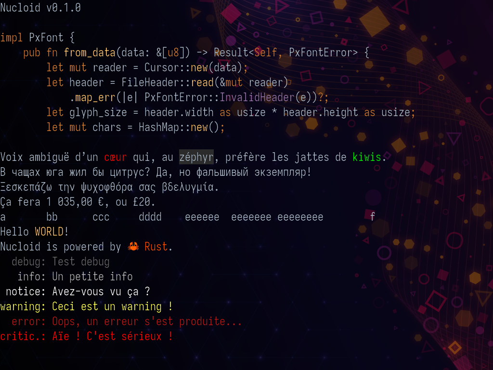

# Nucloid kernel #

Nucloid is a simple monolithic kernel written in Rust currently targeting
x86-64; with intent to support AArch64. There will be no support for 32 bits
architectures.

Nucloid is highly experimental and still in its early stage of development,
use this code with caution.

## Building Nucloid ##

For build instructions, see [`BUILDING.md`](BUILDING.md).

## Credits ##

The `media/iosevka.pxfont` is a bitmap font generated from Iosevka, by
*Belleve Invis*; see https://typeof.net/Iosevka/.

The wallpaper `media/wallpaper.png` "Milky way" by *ruvkr* published under
CC-BY-SA-4.0; see https://github.com/ruvkr/milkyway.
